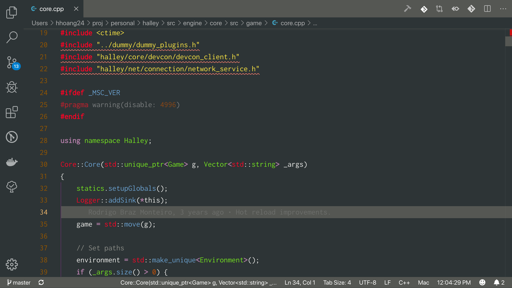

# README

Oblivion Theme catered for C++

Port of gedit/emacs' Oblivion theme, developed by Palo Borelli.

Imperfect due to how TM scope works, maybe can improve in the future.

WARNING: Disable Enchanced Colorization to fully utilise the theme. `C_Cpp.enhancedColorization` to `false`.

**Enjoy!**
